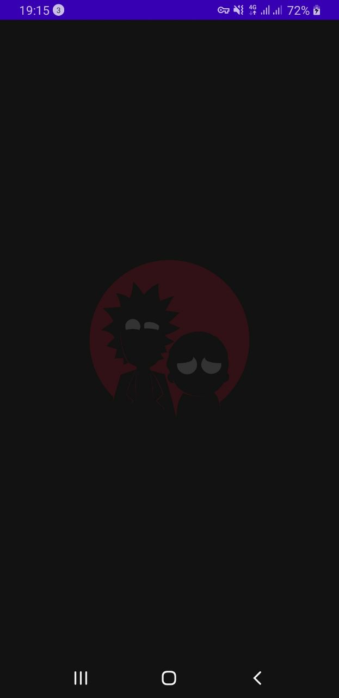
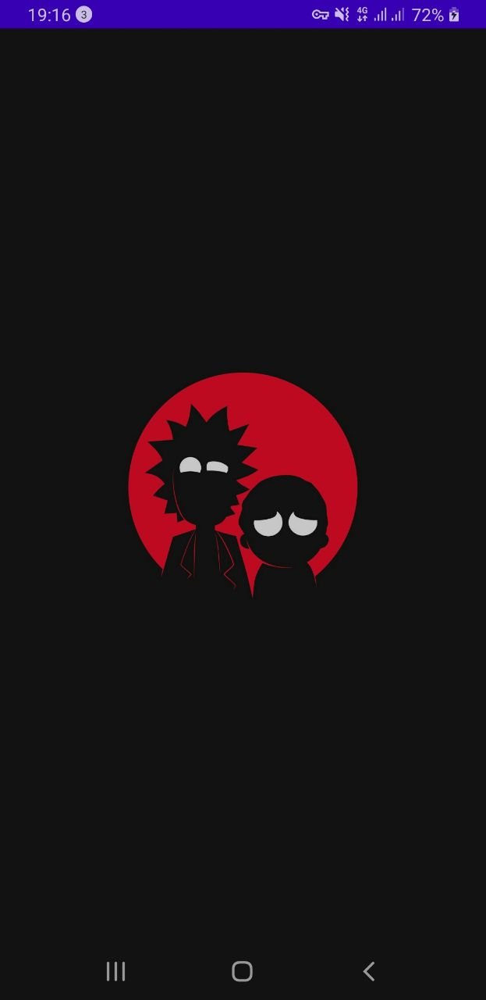
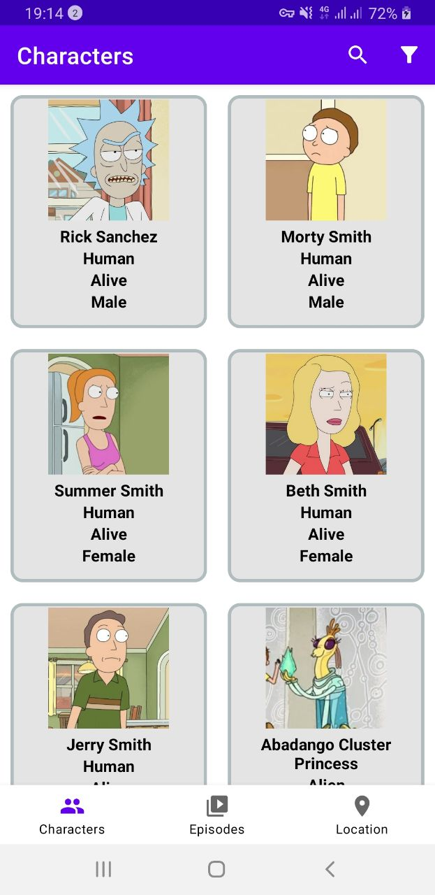
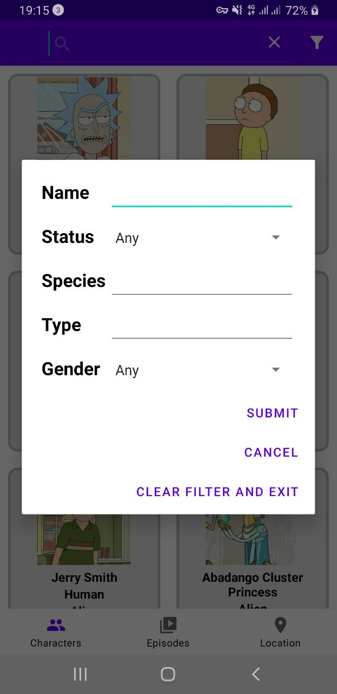
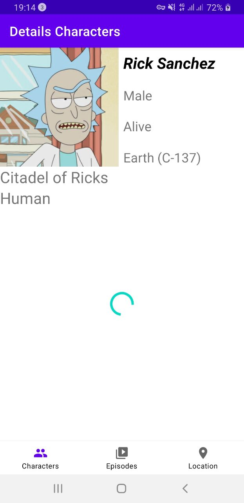
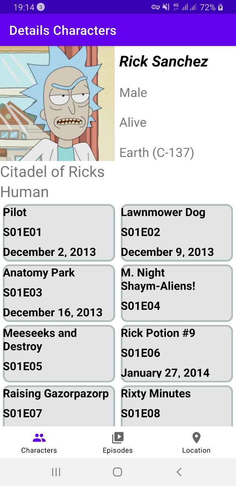

# Rick-and-Morty
Application written in Kotlin

## Table of contents
* [General info](#general-info)
* [Technologies](#technologies)
* [Setup](#setup)
* [Contributors](#contributors)

##GENERAL INFO

The application supports caching and has the ability to work without the Internet.
The filtering functionality also supports work without the Internet.
All tabs support Pull-to-Refresh.
At the time of data loading, a progress indicator is displayed.
When the application is opened, SplashScreenActivity is displayed. This activity is displayed as a background for the system Window, a picture of the main characters, symbolizing the application.
The Picasso library was used to work with pictures.
For fragments containing RecyclerView, adapters that render lists have been created.
Also, for each fragment, its own View Model has been created that receives data and processes changes.

App contains a bottom navigation with 3 tabs: Characters, Episodes, Locations.
Each tab has access to filtering for that tab.
Clicking on an item from the list opens a screen with the selected character's details.

#### Screenshots:

	
	
	
	
   	
	

##Technologies

Kotlin
Clean Architecture
MVVM
Kotlin Coroutines
Retrofit2
Picasso

## Setup

### From Android Studio

Just clone or download the project from GitHub and run it from your Android Studio.
   
